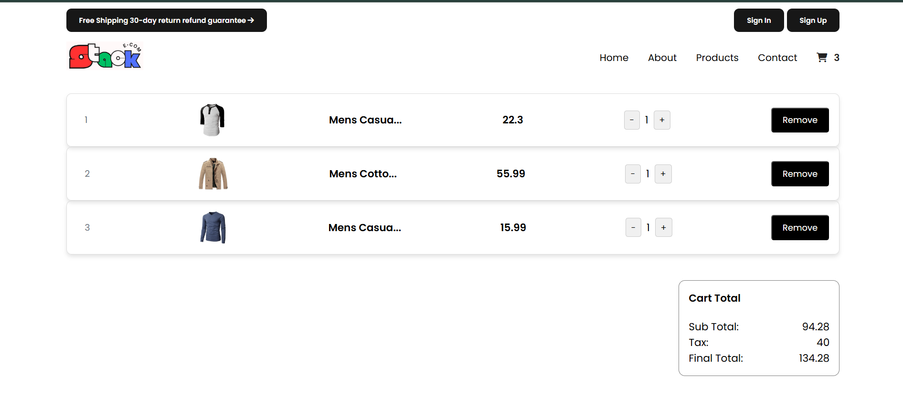

# 🛒 Stack E-com

**Stack E-com** is a lightweight and responsive e-commerce cart project built using **HTML**, **CSS**, and **JavaScript**, powered by **Vite** for blazing-fast development. It focuses on clean UI, smooth cart functionality, and efficient local storage integration — all without a backend.


Check out the live project 👉 [Stack E-com](https://stackecom.netlify.app/)  


---


### 🧩 Core Features

1. **Add to Cart System**  
   - Dynamically adds items to the cart and updates quantities.

2. **Increment / Decrement Product Quantity**  
   - Allows real-time changes to the number of items in the cart.

3. **Remove from Cart**  
   - Lets users delete items from their cart easily.

4. **Cart Total Calculation**  
   - Auto-calculates the total price as users interact with the cart.

5. **Local Storage Integration**  
   - Saves cart data even after refreshing or closing the browser.

---

### 💎 User Experience Enhancements

1. **Responsive Design**  
   - Clean, mobile-friendly UI that works across all screen sizes.

2. **Modular JavaScript Structure**  
   - Code split into multiple files for clarity and maintainability.

---

## 🛠️ Technologies Used

- **HTML5**: For structuring web content.
- **CSS3**: For styling the layout.
- **JavaScript (ES6+)**: For dynamic functionalities.
- **Vite**: For development server and production builds.

---

## 💡 Skills Enhanced

1. DOM manipulation using JavaScript.  
2. Managing app state with Local Storage.  
3. Modular coding practices.  
4. Building projects using Vite and ES modules.  
5. Responsive layout development using CSS.

---

## 📂 Project Structure

```
Stack_Ecom/
├── node_modules/                 # Installed dependencies
├── public/                       # Static assets
│   ├── ecomgraphic.png
│   ├── ecomhero.png
│   ├── ecomherophone.png
│   ├── headphone.jpeg
│   ├── laptop.webp
│   ├── logo.png
│   └── nothing.webp
├── src/                          # Source files
│   ├── addProduct.js
│   ├── addToCart.js
│   ├── fetchQtyFromLS.js
│   ├── getCartProductsFromLS.js
│   ├── incrementDecrement.js
│   ├── itemToggle.js
│   ├── main.js
│   ├── removeProductFromCart.js
│   ├── responsive.js
│   ├── showAddToCart.html
│   ├── showAddToCart.js
│   ├── style.css
│   ├── responsive.css
│   ├── toggleToast.js
│   ├── updateCartTotal.js
│   └── updateCartValue.js
├── .gitignore                    # Files and folders ignored by Git
├── index.html                    # Main HTML file
├── package-lock.json             # Dependency lock file
├── package.json                  # Project metadata and dependencies
├── postcss.config.js             # PostCSS configuration (if used)
├── tailwind.config.js            # Tailwind CSS configuration (optional)
├── vite.config.js                # Vite configuration
├── README.md                     # Project documentation
├── ss1.png                       # Screenshot 1
└── ss2.png                       # Screenshot 2

```

## ⚙️ Installation and Setup

1. **Clone the Repository**
   ```bash
   https://github.com/Angshu09/Stack_Ecom.git
   ```

2. **Navigate to the Project Directory**
   ```bash
   cd Stack_Ecom
   ```

3. **Install Dependencies**
   ```bash
   npm install
   ```

4. **Start the Development Server**
   ```bash
   npm run dev
   ```

5. Open your browser and navigate to `http://localhost:5173/` to explore Stack E-com.
 
## 📸 Screenshots

### Home Page


### Add to cart Page


---

Developed with ❤️ by **Angshu Das**.

